### These steps will be followed for the experiment

<!-- **PRE EXPERIMENT QUIZ QUESTIONS**

1) What is photogrammetry technique?
2) What is principle of photogrammetry technique?
3) How is this principle used in satellite imagery?
4) What is the distance between two reference points in this experiment?
5) What do you mean by pixel? -->

#### Preparation of specimens:

1. Click on start experiment button to start the experiment.

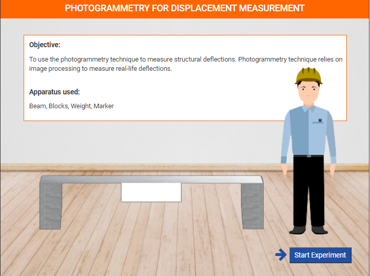

Step 1: a). Click on add button to add left block in the lab.

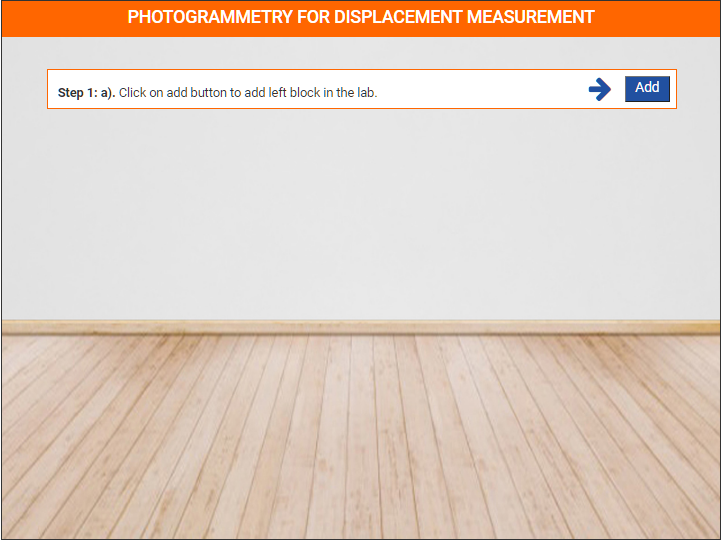

Step 1: b). Click on add button to add right block in the lab.

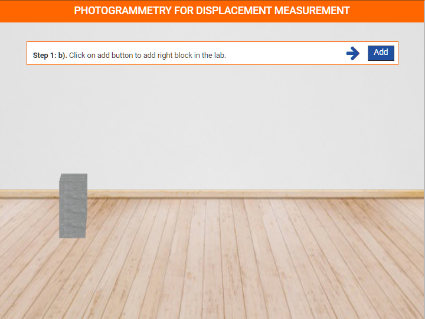

Step 1: c). Click on add button to add alluminium beam in the lab.

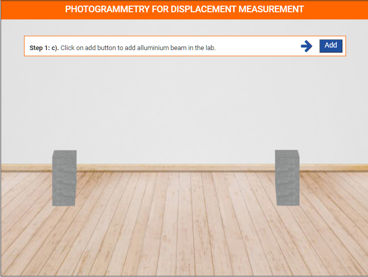

Step 1: d). Click on add button to add plate of beam in the lab.

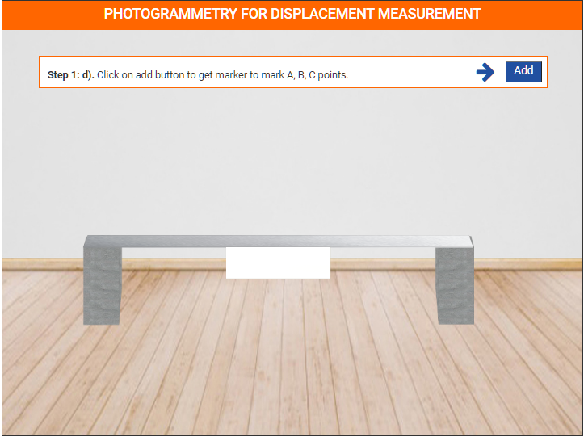

Step 1: d). Click on add button to get marker to mark A, B, C points.

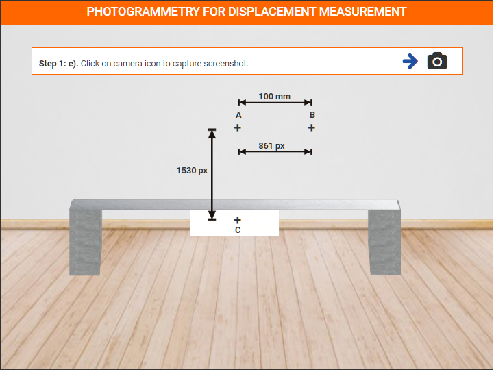

Step 1: e). Click on camera icon to capture screenshot.

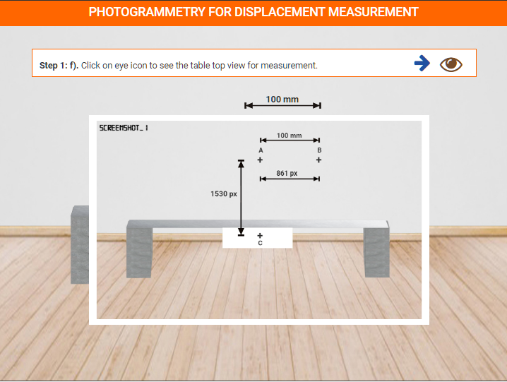

Step 1: f). Click on eye icon to see the table top view for measurement.

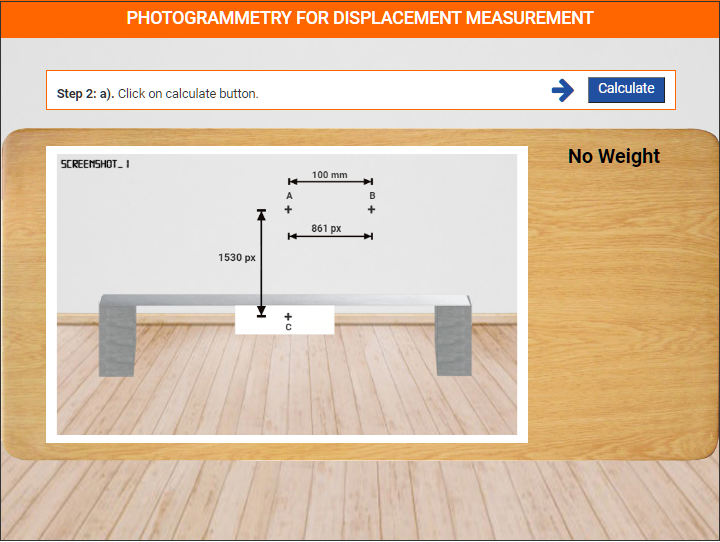

Step 2: a). Click on calculate button.

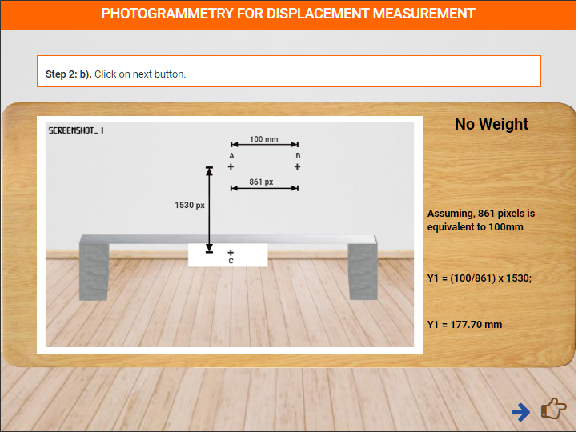

Step 2: b). Click on next button.

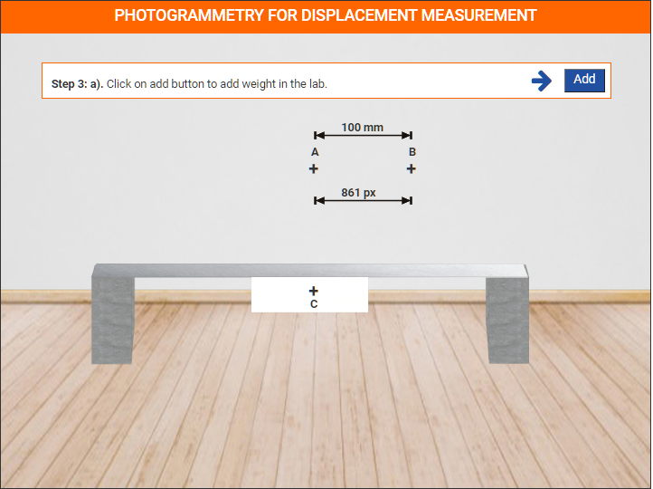

Step 3: a). Click on add button to add weight in the lab.

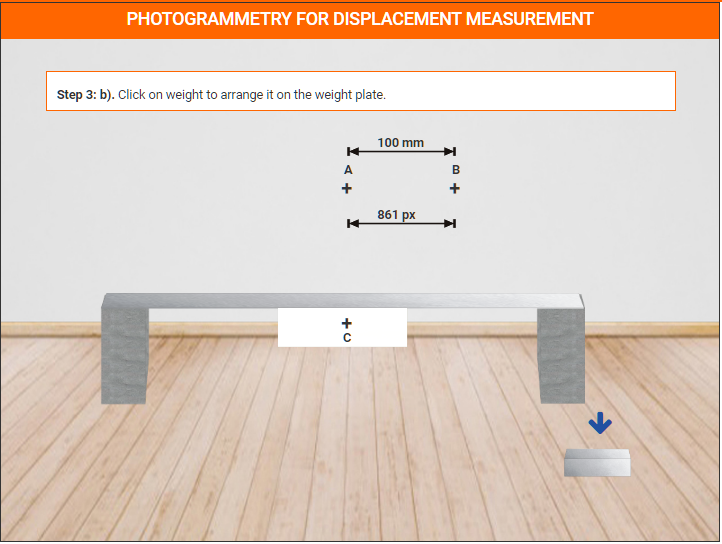

Step 3: b). Click on weight to arrange it on the weight plate.

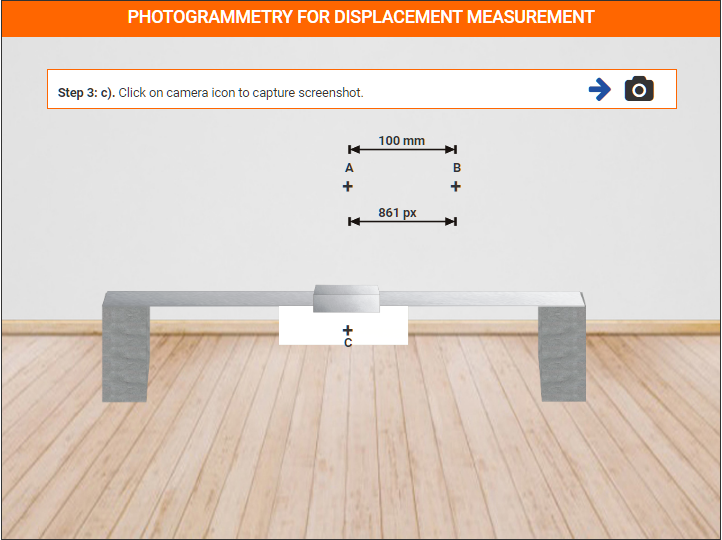

Step 3: c). Click on camera icon to capture screenshot.

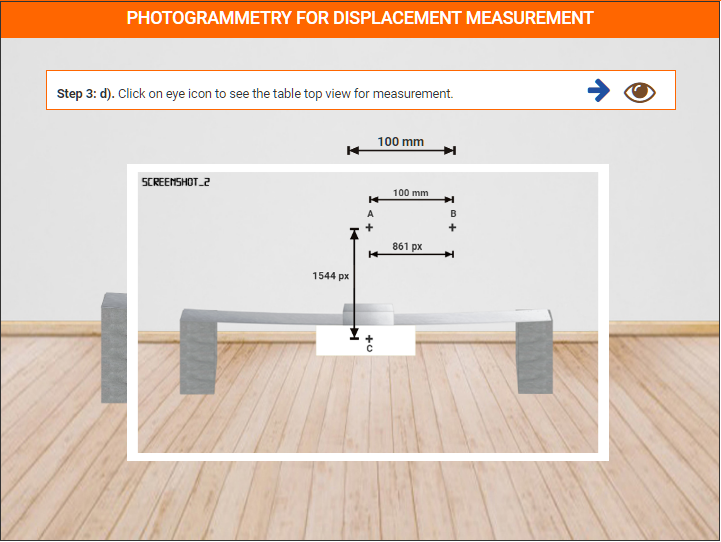

Step 3: d). Click on eye icon to see the table top view for measurement.

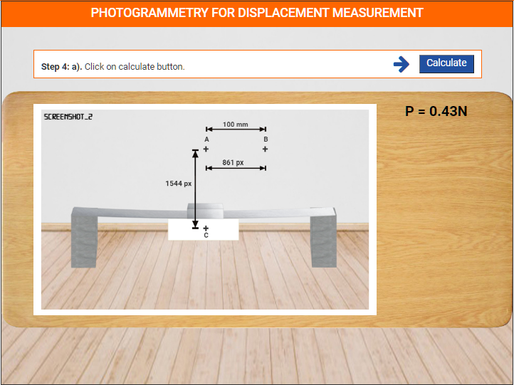

Step 4: a). Click on calculate button.

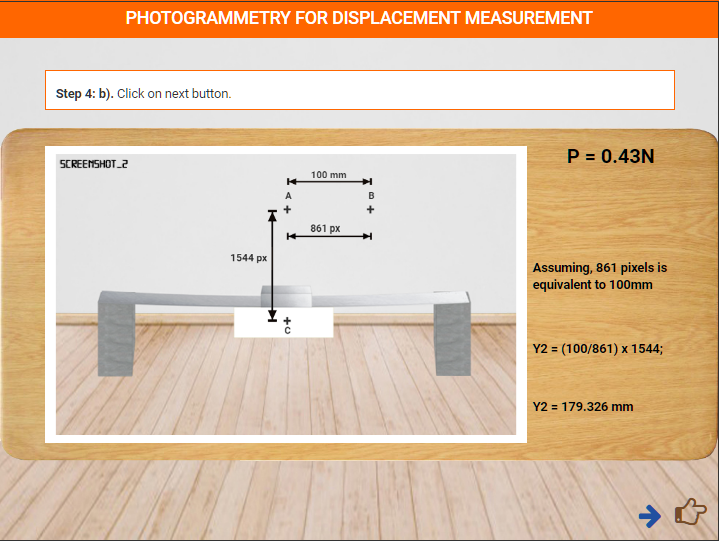

Step 4: b). Click on next button.

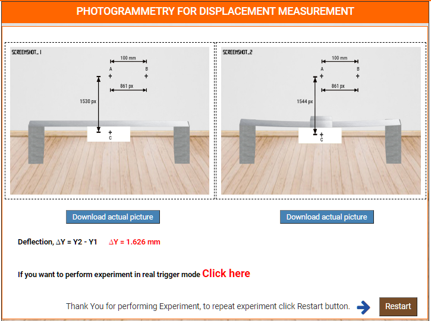

Thank You for performing Experiment.

Click on restart button.

<!-- **POST EXPERIMENT QUIZ QUESTIONS**

1) Plot a graph between 'load' versus 'displacement'.
2) Compare the 'load' versus 'displacement' plot obtained experimentally
and theoretically and compute the error.
3) Compute the resolution.  -->
