### These steps will be followed for the experiment

**Pre Experiment Task**

1) What is photogrammetry technique?
2) What is principle of photogrammetry technique?
3) How is this principle used in satellite imagery?
4) What is the distance between two reference points in this experiment?
5) What do you mean by pixel?

Click on **Start Experiment Button** to start the experiment. 
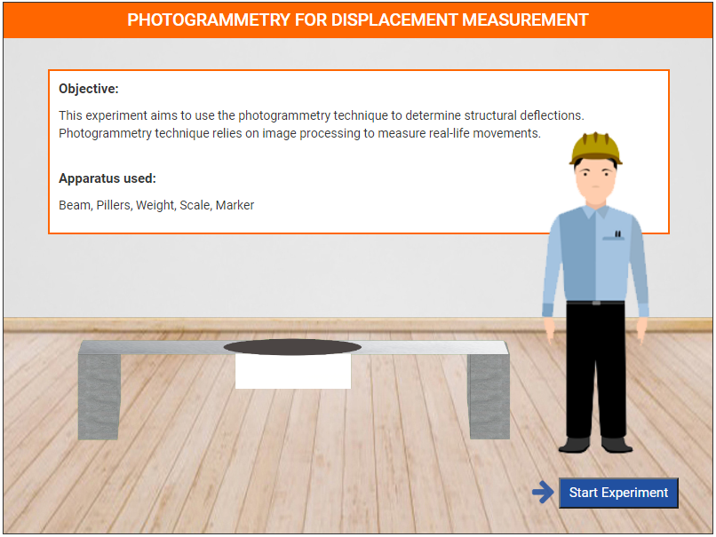 
Step 1: a). Click on Add button to add left piller in the lab. 
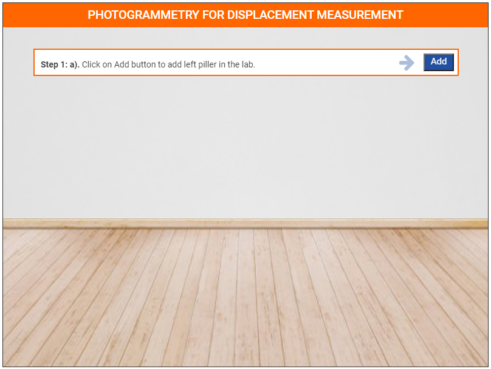 
Step 1: b). Click on Add button to add right piller in the lab. 
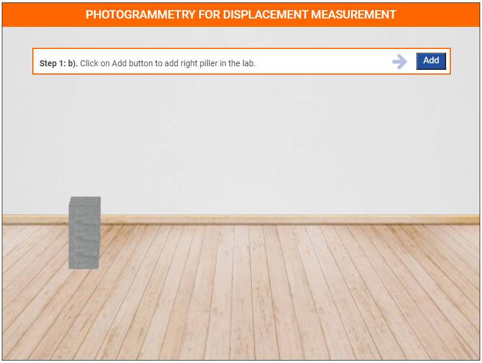 
Step 1: c). Click on Add button to add alluminium beam in the lab. 
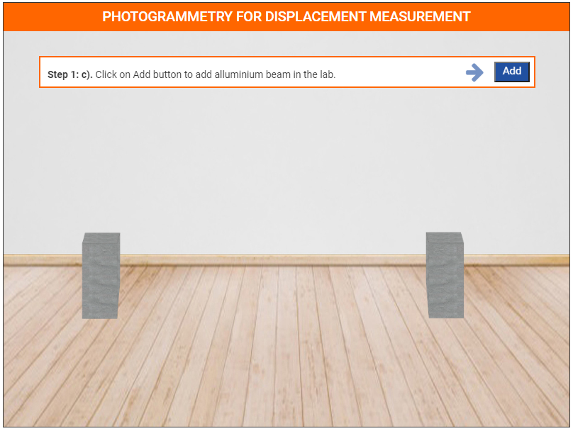 
Step 1: d). Click on Add button to add plate of beam in the lab. 
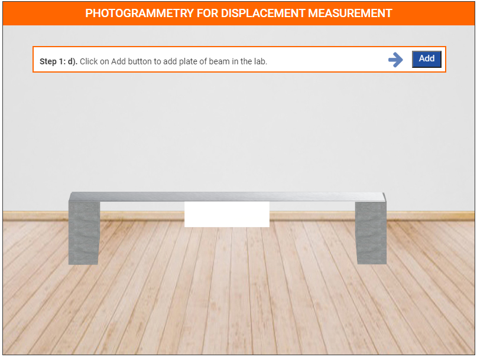 
Step 1: e). Click on Add button to get marker to mark A, B, C points. 
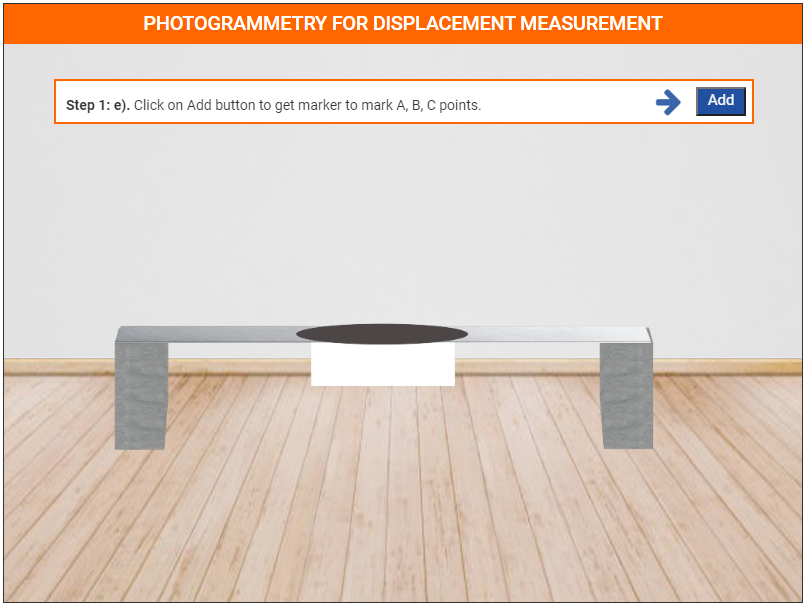 
Step 1: f). Click on Camera icon to take Screenshot. 
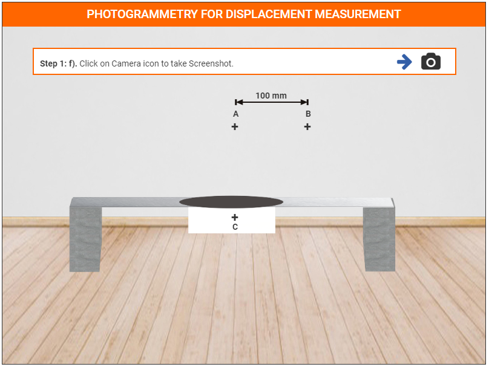 
Step 1: g). Click on Eye icon to see the table top view for measurement. 
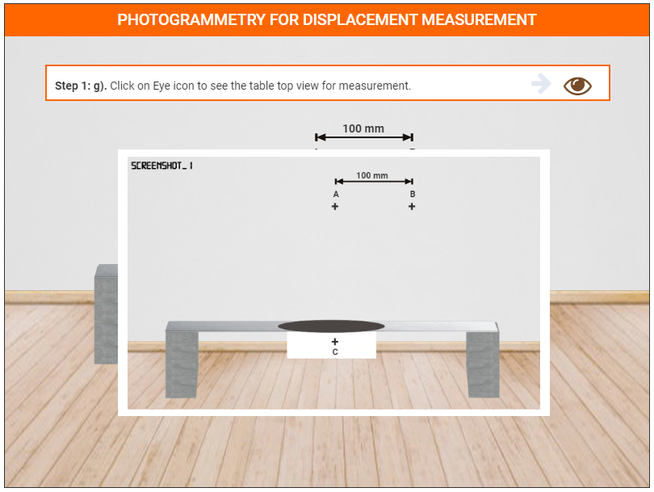 
Step 2: a). Click on Add button to add scale for measure the length. 
 
Step 2: b). Click on next button. 
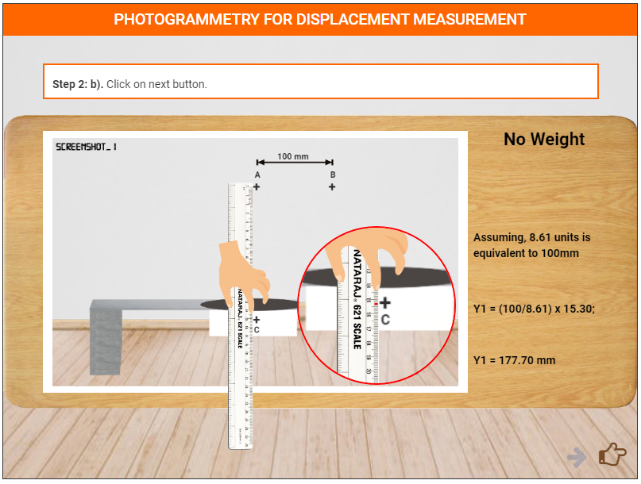 
Step 3: a). Click on Add button to add weight in the lab. 
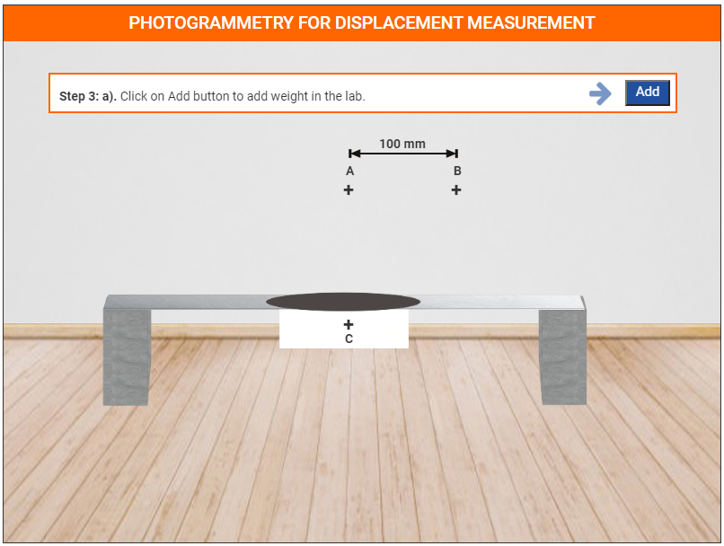 
Step 3: b). Click on weight to arrange them on the weight plate. 
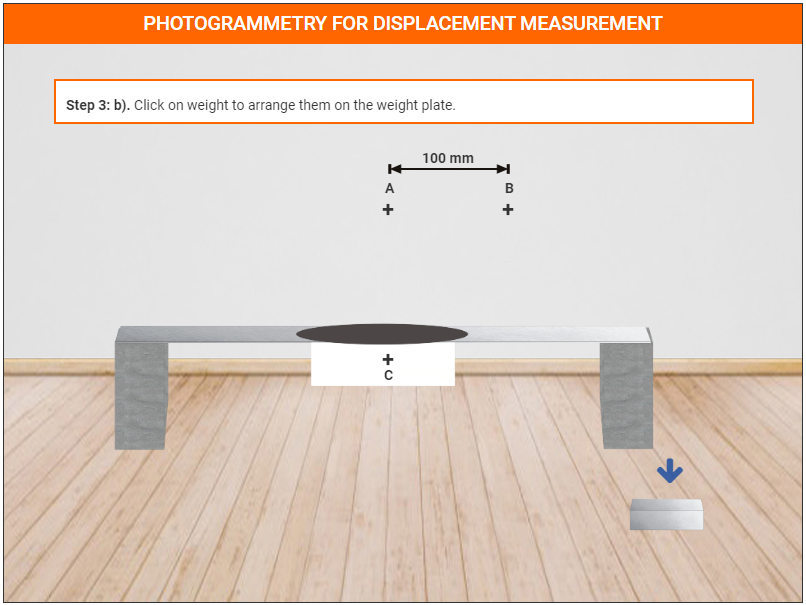 
Step 3: c). Click on Camera icon to take Screenshot. 
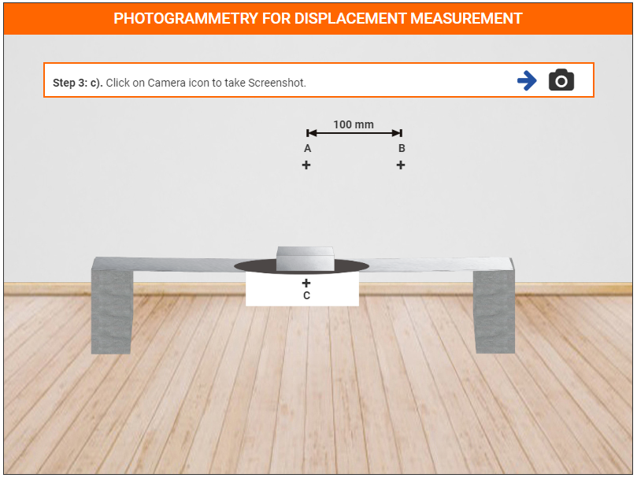 
Step 3: d). Click on Eye icon to see the table top view for measurement.  
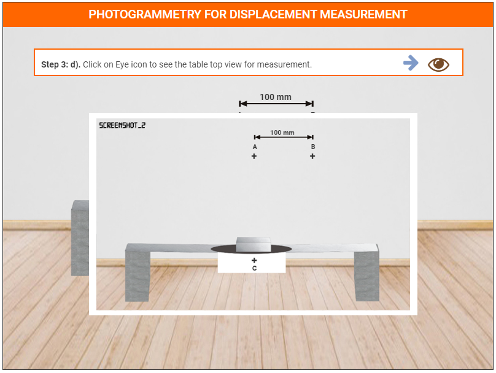 
Step 4: a). Click on Add button to add scale for measure the length.  
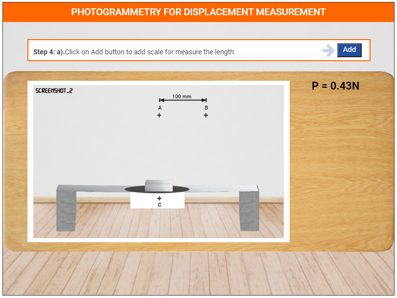 
Step 4: b). Click on next button.  
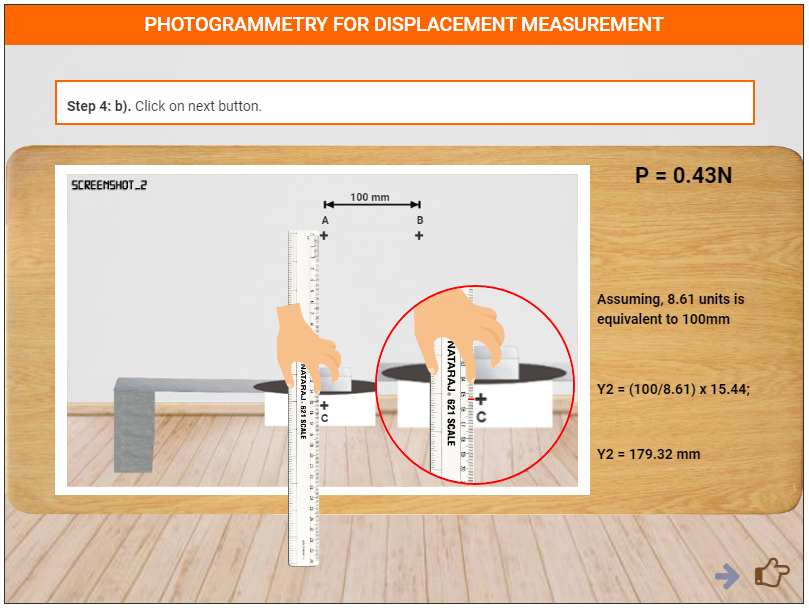 
Click on **Restart Button**. 
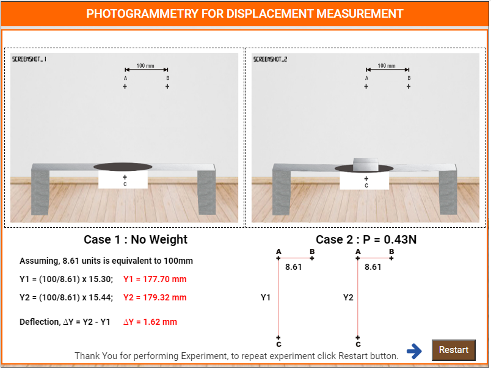 

**Post Experiment Task**

1) Plot a graph between 'load' versus 'displacement'.
2) Compare the 'load' versus 'displacement' plot obtained experimentally
and theoretically and compute the error.
3) Compute the resolution.