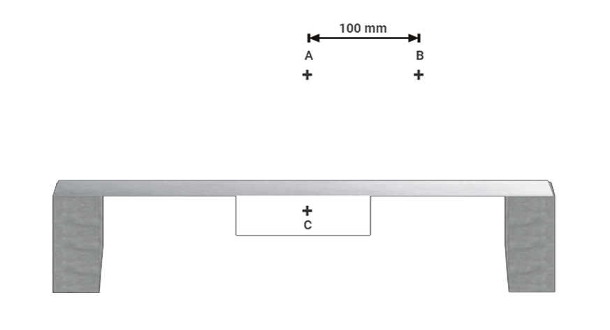

### Theory

This virtual experiment simulates measurement of structural deflections by image analysis. The simulated experimental setup is shown in Fig. 1. It consists of a simply supported aluminium beam which acts as the structure undergoing deflections. A stationary reference frame with two cross marks A and B 100 mm apart is fixed above the beam. The reference frame C is attached to the beam at the mid-point and marked as C. The beam is loaded leading to deflection and movement of C relative to A and B. The pictures of the set-up  are captured before and after the movement to determine the deflection of the beam.

Fig. 1 Experimental set up 

The photographs can be analysed for deflections using MS paint, MS word, ADOBE Photoshop or
MATLAB. The pixel count of the normal drawn from C to AB can be used to determine the vertical
deflections of C in mm, using the principle of proportioning and making use of the fact that the real
distance between points A and B is 100 mm.

If using MATLAB, following command can be used

I = imread('filename');

Imshow(I)

The concept can be extended to structural dynamics problems also by capturing pictures at a very small
interval, say one hundredth of a second, and analyzing them using the computer.
