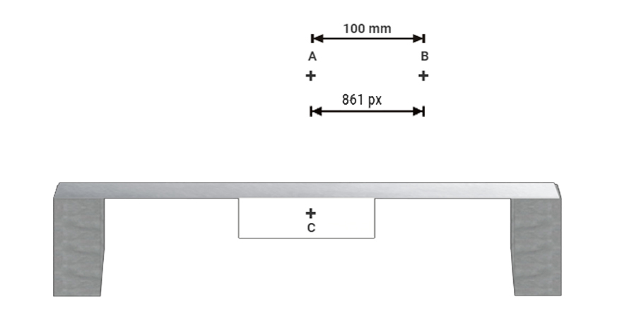

### EXPERIMENTAL METHODOLOGY

This experimental setup is shown in Fig. 1. It consists of a simply supported aluminium beam which acts as
the structure undergoing deflections. A stationary reference frame with two marks A and B 100 mm apart is
fixed above the beam. The reference attached to structure is at the mid point of the beam and marked as C.
The beam is loaded at regular intervals of one hour throughout the day with varying loads, resulting in
varying deflections. 

Fig. 1 Experimental set up 

The photographs can be analysed for deflections using MS paint, MS word, ADOBE Photoshop or
MATLAB. The pixel count of the normal drawn from C to AB can be used to determine the vertical
deflections of C in mm, using the principle of proportioning and making use of the fact that the real
distance between points A and B is 100 mm.

If using MATLAB, following command can be used
I = imread('filename');
Imshow(I)

The concept can be extended to structural dynamics problems also by taking pictures at a very small
interval, say one hundredth of a second, and analyzing them using the computer.